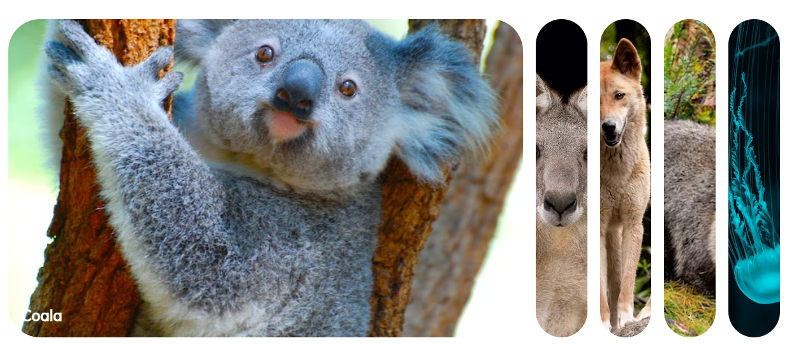
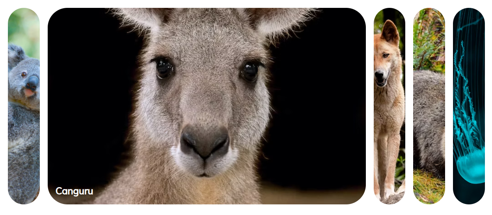

# EXPANDING CARDS
 Aplicação desenvolvida para fins de estudos e conhecimentos, unida com minha paixão pela fauna Australiana.
 
## RESULTADO

 
## PROJETO 
O projeto de expansão de cards, trata de um evento em que ao clicar na imagem do card desejado, você poderá desfrutar de uma imagem maior do animal descrito.
  
## TECNOLOGIAS 

 
 
 
 

